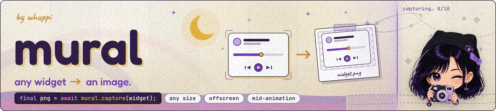

<!--
  Banner stays <picture> for GitHub's dark/light. pub.dev strips <picture>
  when sanitizing the README, so the publish step flattens it to the inner
   via `tool/ci/release.sh --stamp-readme` (the repo copy is untouched).
  Drop both once pub.dev renders <picture>. Tracking:
  dart-lang/pub-dev#5923, dart-lang/pub-dev#6363, google/dart-neats#383.
-->
<p align="center">
  <picture>
    <source media="(prefers-color-scheme: dark)"  srcset="assets/banner_dark-web-min.webp">
    <source media="(prefers-color-scheme: light)" srcset="assets/banner_light-web-min.webp">
    
  </picture>
</p>

<p align="center">
  <a href="https://pub.dev/packages/mural"></a>
  <a href="https://pub.dev/packages/mural/score"></a>
  <a href="https://pub.dev/packages/mural/score"></a>
  <a href="https://github.com/whuppi/mural"></a>
  <a href="LICENSE"></a>
</p>

Capture any Flutter widget as an image, at any size: a widget that was never on screen, the exact frame of a running animation, or a 100,000-row list that is too big for any screenshot API. Mural photographs the widget in strips and glues them together perfectly, so a giant capture uses the same few megabytes of memory as a thumbnail.

> **Why a package? Doesn't Flutter's `RepaintBoundary.toImage` do this?** Only up to the GPU's maximum texture size: anything bigger comes back silently shrunken and blurry ([flutter/flutter#118024](https://github.com/flutter/flutter/issues/118024)), and every screenshot package built on top of it inherits the same limit. Mural has no limit, captures widgets that were never on screen, and stitches its strips so perfectly that the result looks like one single shot.

> like it? a [⭐ star](https://github.com/whuppi/mural) or [👍 like](https://pub.dev/packages/mural) is the entire marketing budget. [Bugs & features →](https://github.com/whuppi/mural/issues)

---

<details>
<summary><b>👀 Peek inside</b></summary>

- [Install](#install)
- [Quick start](#quick-start)
- [The task](#the-task)
- [Usage](#usage)
  - [Offscreen capture](#offscreen-capture)
  - [Readiness — signals, never timers](#readiness--signals-never-timers)
  - [On-screen capture](#on-screen-capture)
  - [Streaming to a sink](#streaming-to-a-sink)
  - [Output formats](#output-formats)
- [Error handling](#error-handling)
- [Platform support](#platform-support)
- [Inside a capture](#inside-a-capture)
- [Not in the box](#not-in-the-box)
- [Docs](#docs)

</details>

---

## Install

```yaml
dependencies:
  mural:
```

Nothing else to do, on any platform. It's pure Dart on top of Flutter: no native code to build, nothing to configure. Android, iOS, macOS, Windows, Linux, and web from one codebase.

---

## Quick start

Turn a widget into a PNG (one that was never even on screen) and write it to a file. The whole round trip:

```dart
import 'package:mural/mural.dart';

// one Mural instance, reused everywhere
final mural = Mural();

// a widget, straight to an image at 3x
final shot = await mural.capture(
  ReceiptView(order),           // never added to your UI
  context: context,             // borrows your app's theme + text direction
  options: const MuralOptions(pixelRatio: 3),
);

// shot.bytes is a finished PNG
await File('receipt.png').writeAsBytes(shot.bytes);
```

That's the shape of every call: give mural a widget (or a key), await the image. Three doors, one per situation:

```dart
// 1. Capture a widget WITHOUT showing it: receipts, share cards, posters.
mural.capture(widget, context: context)

// 2. Capture something already ON screen: wrap it once, shoot anytime.
mural.captureBoundary(boundaryKey)

// 3. Capture something HUGE: the bytes stream out as they're made.
mural.captureInto(sink, widget, context: context)
```

The `context` you pass means "make it look like it belongs in my app": your theme and text direction flow in, font scaling too. The widget itself never enters your widget tree, and nothing on screen even flickers.

---

## The task

Big capture, and the user might not wait for it? Every door returns a **`MuralTask`**: an ordinary `Future` you `await`, plus a progress feed and a `cancel()` button. For small captures, ignore all of that and just `await`; that's what the Quick start did.

```dart
// run it and await it — your normal code
final task = mural.capture(hugeWidget, context: context); // starts running
try {
  final shot = await task;
  save(shot); // success
} on MuralCancelled {
  // cancelled — mural and everything else keep working
}
```

```dart
// show progress: a fraction from 0 to 1, plus details when you want them
task.progress.listen((p) {
  bar.value = p.fraction;
});
```

```dart
// stop it, from a Cancel button or your widget's dispose()
task.cancel(); // the await above now throws MuralCancelled
```

Three rules and you're safe:

- **The `cancel()` call never throws.** It sends a stop request and returns. Safe to call twice, a no-op once the task is done.
- **`MuralCancelled` appears only when you `await` the task**, never as a half-finished image. That's the spot to wrap in `try/catch`.
- **Never await the task? Nothing to handle.** Cancel it and move on.

<details>
<summary><b>🧩 what else is in the progress feed?</b></summary>

<br>

Each progress event says which phase the capture is in, with that phase's numbers: `MuralLayoutProgress` (laying the widget out), `MuralCaptureProgress` (the output dimensions, tiles done, rows delivered; here is where you learn the image's size before it exists), `MuralEncodeProgress` (bytes emitted so far). Match the one you care about:

```dart
task.progress.listen((p) {
  if (p case MuralCaptureProgress(:final width, :final height)) {
    label.text = '$width × $height';
  }
});
```

</details>

<details>
<summary><b>🧩 why a task instead of a plain Future?</b></summary>

<br>

A thumbnail finishes before a progress bar could even render. A 60,000-row capture runs for seconds, long enough that a real app needs to show progress and offer a Cancel. Splitting that into two APIs (`capture` and `captureWithProgress`) means two versions of every door. One handle does both: `await` it like a `Future` and the extras cost nothing; use `.progress` and `.cancel()` when the capture is big enough to matter.

</details>

---

## Usage

### Offscreen capture

The widget builds and renders in a private little world that borrows your app's look (theme, text direction, font scaling) without ever appearing on screen. This is the door for share cards, receipts, certificates: anything your app produces as an image.

```dart
final shot = await mural.capture(
  ShareCard(stats),
  context: context,
  options: const MuralOptions(pixelRatio: 2),
  stage: const MuralStage(background: Colors.white), // behind transparent bits
);
```

`MuralStage` describes that private world: how much room the widget gets, what sits behind transparent content, and the readiness signal below. A widget that wants to grow forever (a long list, a tall column) just needs ONE axis pinned; it picks its own size on the other:

```dart
// "be at most 400 wide, and as tall as you like"
stage: const MuralStage(constraints: BoxConstraints(maxWidth: 400))
```

### Readiness — signals, never timers

Your widget shows a network photo. How does mural know the photo has actually ARRIVED before taking the shot, instead of capturing a gray placeholder?

It doesn't guess, and it doesn't wait a fixed number of milliseconds and hope. You give it a signal: `MuralStage.ready` is a callback that returns a `Future`, and the shot waits for exactly that future.

For images, Flutter already has the perfect signal: `precacheImage` completes when the image is decoded and ready to paint.

```dart
stage: MuralStage(
  // "take the shot when this photo has loaded"
  ready: (context) => precacheImage(NetworkImage(photoUrl), context),
)
```

A widget that loads its own data works the same way. Expose a future and pass it in:

```dart
// "take the shot when the chart has its data"
ready: (_) => chartController.dataLoaded
```

Coming from a package that had a delay option, and you still want one? A timer is just another future — the difference is that now the delay is your visible choice, not a hidden default:

```dart
// "wait 300 ms, then take the shot" — works, but a real signal is better
ready: (_) => Future.delayed(const Duration(milliseconds: 300))
```

<details>
<summary><b>🧩 why does <code>ready</code> get the offscreen context?</b></summary>

<br>

Because assets resolve against the tree they render in. A capture at `pixelRatio: 3` must load the 3x asset variant. The offscreen tree's media query says so; your on-screen context would say something else. `precacheImage` through the offscreen context loads the RIGHT variant and completes exactly when it's decoded. One callback does both jobs.

</details>

### On-screen capture

To capture something already on screen (a drawing canvas, a game view), wrap it once and shoot it whenever you choose:

```dart
final boundaryKey = GlobalKey();

// in your build: wrap the part you want to capture
MuralBoundary(key: boundaryKey, child: DrawingCanvas())
```

```dart
// then shoot from anywhere: a button, a timer, your own logic
onPressed: () async {
  final frame = await mural.captureBoundary(boundaryKey);
  save(frame);
}
```

The moment you CALL `captureBoundary` is the moment you get. Even if the widget is animating, the shot shows that exact frame: the call snapshots it at that instant, and the pixels are produced in the background. Your app never pauses. Fire three calls in a row and you get three distinct moments, like a camera burst.

`MuralBoundary` is a drop-in replacement for `RepaintBoundary`, with no size limit.

<details>
<summary><b>🧩 how is the shot instant when the pixels come later?</b></summary>

<br>

The call records what the boundary has painted, as lightweight drawing instructions rather than pixels, and that recording is complete before the call returns. Nothing can change it afterwards: the live widget keeps animating and rebuilding, and the capture still shows the recorded instant. Turning the recording into pixels happens later, strip by strip.

</details>

### Streaming to a sink

What if the image is too big to hold in memory at all, like a full year of chat history as one PNG? Don't hold it. Stream it:

```dart
final info = await mural.captureInto(
  sink,                        // anywhere bytes can go: a file, a socket
  TranscriptView(fullHistory), // the widget, same as always
  context: context,
  options: const MuralOptions(memoryLimitBytes: 8 << 20), // stay under 8 MB
);

// the PNG went to the sink; you get its numbers back:
print('${info.width} × ${info.height}, ${info.byteCount} bytes');
```

The `sink` is any `Sink<List<int>>`: a `File`'s `openWrite()`, an HTTP upload, your own class with an `add` method. Mural writes finished chunks into it while it encodes, so memory stays under `memoryLimitBytes` (the default is about 64 MB) no matter how enormous the output is. The sink is yours; mural doesn't close it.

### Output formats

PNG is the default, ready to use as-is. For your own encoder or a video pipeline, take the raw pixels instead:

```dart
options: const MuralOptions(format: MuralFormat.rawRgba)
```

You get plain RGBA bytes, row by row from the top, and they're the exact same bytes on every platform, web included.

---

## Error handling

When something goes wrong you never get a mystery: every failure is a typed `MuralError`, and its message says what to do next:

```dart
try {
  final shot = await mural.capture(widget, context: context);
} on MuralLayoutError {
  // The widget laid out empty or unbounded — bound an axis via
  // MuralStage.constraints.
} on MuralBuildError catch (e) {
  // The widget threw during build; e.cause is the original error.
} on MuralCancelled {
  // task.cancel() was called.
}
```

The rest of the family: `MuralRasterError` (the engine could not rasterize even a spec-floor tile), `MuralEncodeError`, `MuralBoundaryError` (the key points at nothing capturable), and `MuralBudgetError` (the `memoryLimitBytes` is too small for the image's width; the message carries both numbers and the fix).

There is no `MuralUnknownError`. Every stop has a name.

---

## Platform support

| Platform | Capture | Encode off the UI thread |
|---|---|---|
| Android / iOS / macOS / Windows / Linux | ✅ | dedicated isolate |
| Web | ✅ | browser-native `CompressionStream` |

Every door works on every platform. There's no per-method matrix to consult and no `kIsWeb` to write. The web engine plays by slightly different rules internally; mural absorbs all of it, and your code and your bytes come out identical everywhere. (How, exactly, is in [docs/ARCHITECTURE.md](docs/ARCHITECTURE.md); you never need to know.)

Any browser works, too. You don't check for anything: mural uses the browser's built-in compressor where it exists and quietly does the work itself where it doesn't. Same bytes either way.

---

## Inside a capture

One capture, from the call to the bytes:

1. **The widget becomes a plan.** Mural measures the widget and plans the shot as strips, because the GPU can rasterize only a limited area at once. A small capture is one strip; a giant one is hundreds.
2. **The first big capture teaches mural the GPU's limit.** No API reports it, so mural learns it from the engine's response to a real capture and remembers it on the instance. Every later capture plans correctly on the first try.
3. **Each strip is rendered as part of one big photo.** Strips are positioned so the engine's own pixel patterns continue across seams, and each strip gets extra margin so shadows and blurs that cross a seam stay correct. A test joins the strips, takes the same widget in one shot, and compares the two results pixel for pixel.
4. **Strips flow through the encoder one at a time.** Each strip is compressed into the PNG and released before the next one arrives. That is why a wall-sized capture and a thumbnail use the same working memory.
5. **Encoding never blocks your UI.** PNG compression is lossless packing: the file gets smaller, the pixels stay exactly the same. That work runs on a background isolate on native, and on the browser's built-in compressor on web.

The finished bytes arrive as one image (`capture`, `captureBoundary`) or land in your sink strip by strip (`captureInto`).

<details>
<summary><b>🧩 how do you learn a limit no API will tell you?</b></summary>

<br>

Both engine backends clamp an oversize snapshot PROPORTIONALLY (`scale = min(1, maxSize / longestSide)`), so the longest side of what comes back reveals the exact limit in one response. Engines that throw instead back off geometrically to the GLES 3.0 spec floor (2048). Either way the limit it learned stays on the `Mural` instance, so discovery happens at most once per device. The engine sources verifying this are pinned in [docs/UPDATING.md](docs/UPDATING.md).

</details>

<details>
<summary><b>🧩 why do strips need extra margin?</b></summary>

<br>

Shadows and blurs are computed from the surface being rendered. A strip edge truncates that source, so an effect SPLIT by a seam renders measurably wrong: up to 66 color levels off in testing. Each strip is therefore rendered with extra margin (`MuralOptions.bleed`) on the sides that touch another strip, and the margin is cropped away when the strips are joined; every effect near a seam then sees the same neighborhood that a one-shot render sees. The default covers Material shadows to about elevation 8 and blurs to about sigma 5; content with stronger effects raises it. The image's outer borders get no margin; they are already the one-shot render's own surface edges.

</details>

---

## Not in the box

What the shipped package doesn't do, and what to use instead. Full per-capability status in the [capability roadmap](docs/CAPABILITY_ROADMAP.md).

- **Platform views** (Google Maps, Camera, WebView) render blank in ANY Flutter capture: theirs are OS-composited surfaces with no drawing instructions for Flutter to rasterize ([flutter/flutter#102866](https://github.com/flutter/flutter/issues/102866)). An OS-level compositing satellite is on the [roadmap](docs/CAPABILITY_ROADMAP.md).
- **WebP / JPEG encoding.** PNG comes built in; for anything else, take `rawRgba` and hand the pixels to the encoder of your choice; nothing is lost on the way.
- **Video / animation export.** One capture is one moment. For frames, fire `captureBoundary` on each tick (every call captures its own instant) and feed the `rawRgba` frames to your video encoder.

---

## Docs

The README covers the everyday stuff. wanna go deeper?

| Doc | What's inside |
|---|---|
| [Architecture](docs/ARCHITECTURE.md) | How it's built: the contract, the pipeline, the platform seams, seam fidelity |
| [Capabilities](docs/CAPABILITY_ROADMAP.md) | What's shipped, what's planned, what won't happen |
| [Updating](docs/UPDATING.md) | Maintenance recipes and the watchlist of pinned engine behaviors |
| [Contributing](CONTRIBUTING.md) | Setup, PR workflow, the quality gates |
| [Example app](example/) | Every door exercised: offscreen, on-screen, streaming, and every typed error |

---

## License

MIT. See [LICENSE](LICENSE).
